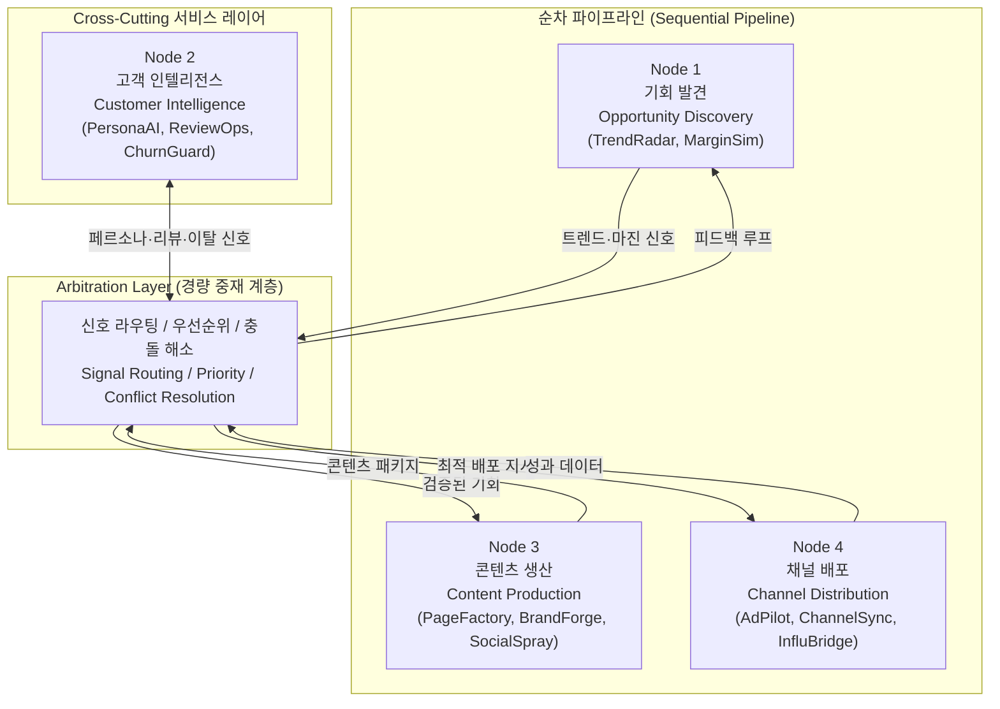
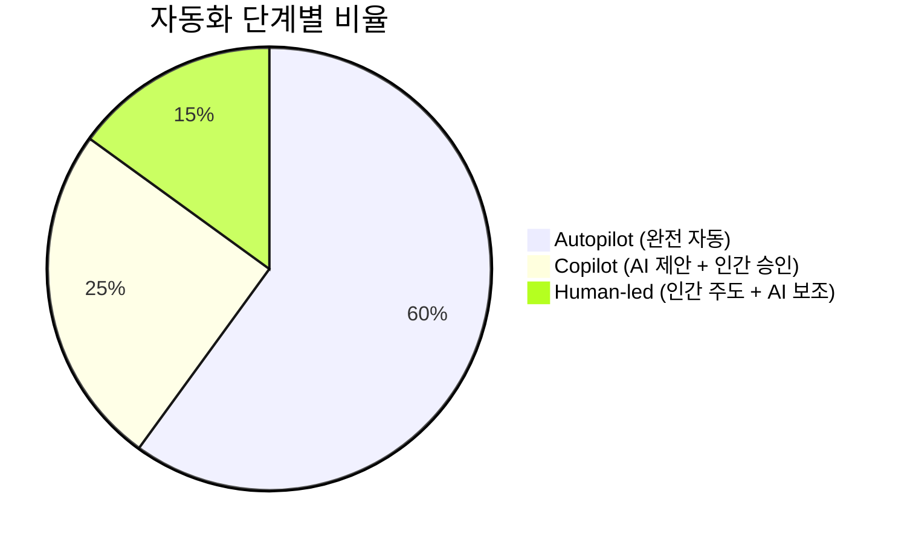
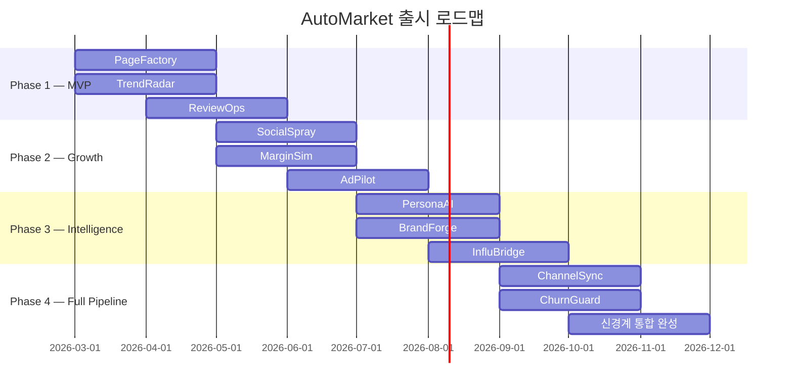

# AutoMarket 플랫폼 총괄 개요

> **TL;DR**
> 1. AI Agent 기반 그래프 파이프라인으로 이커머스 전체 라이프사이클(기회 발견 → 고객 이해 → 콘텐츠 생산 → 채널 배포)을 자동화한다.
> 2. 4개 Core Node가 12개 독립 SaaS 제품으로 분해되어, 각각 단독으로도 판매 가능한 모듈형 구조다.
> 3. Time-to-Revenue(TTR) 24시간 이내를 목표로, 반복 업무의 ~84%를 AI가 처리하고 사람은 전략 의사결정에만 집중한다.

---

## 비전과 미션

**비전**: AI가 이커머스의 반복 업무를 대체하고, 사람은 전략적 의사결정에 집중한다.

**미션**: 브랜드가 아이디어에서 첫 매출까지 걸리는 시간(Time-to-Revenue)을 **24시간 이내**로 단축한다.

---

## Executive Summary

AutoMarket은 이커머스·브랜드 사업의 전체 라이프사이클을 **AI Agent 기반 그래프 파이프라인**으로 관리하는 플랫폼이다.

핵심 설계 원칙은 두 가지다.

1. **모듈형 가치 (Modular Value)**: 각 노드는 독립 SaaS 도구로서 단독 수익화가 가능하다. 플랫폼 전체를 도입하지 않아도 개별 제품만으로 즉시 가치를 제공한다.
2. **점진적 통합 (Progressive Integration)**: 노드들이 연결될수록 파이프라인 전체의 자동화 수준이 높아지며, 네트워크 효과가 누적된다.

각 노드 사이를 흐르는 신호는 **Arbitration Layer**가 중재한다. Arbitration Layer는 노드 간 데이터 라우팅, 우선순위 결정, 충돌 해소를 담당하는 경량 조율 계층이다.

---

## 핵심 수치 (Key Metrics)

| 항목 | 수치 | 비고 |
|------|------|------|
| Core Nodes | 4개 | 기회·고객·콘텐츠·채널 |
| SaaS Products | 12개 | 노드당 평균 3개 |
| Human Decisions | 3가지 | 전략·예산·브랜드 방향성 |
| Time-to-Revenue 목표 | 24시간 | 아이디어 → 첫 매출 |
| Autopilot 비율 | 60% | 완전 자동 처리 |
| Copilot 비율 | 25% | AI 제안 + 인간 승인 |
| Human-led 비율 | 15% | 인간 주도, AI 보조 |
| 평균 AI 자동화 (목표) | ~84% | Autopilot + Copilot |

---

## 메인 아키텍처 (Main Architecture)



Node 2(고객 인텔리전스)는 순차 파이프라인에 직렬로 포함되지 않는다. 모든 노드에 공통으로 맥락을 제공하는 **cross-cutting 서비스 레이어**로 동작하며, Arbitration Layer를 통해 각 노드의 의사결정에 영향을 미친다.

---

## 제1원리 사고 과정 요약 (First Principles)

이커머스 사업의 근본 3요소에서 출발했다.

| 요소 | 의미 | 담당 노드 |
|------|------|-----------|
| Supply (공급) | 팔 물건 — 무엇을, 어떤 마진으로 | Node 1 |
| Demand (수요) | 살 사람 — 누가, 왜 사는가 | Node 2 |
| Match (매칭) | 둘의 연결 — 어떻게, 어디서 만나는가 | Node 3 + 4 |

아키텍처는 단순화 방향으로 진화했다.

```
v2 (9 nodes) → v3 (5 nodes) → v5 (6 nodes) → v6 (4 nodes, 최종)
```

각 버전에서 중복 노드를 통합하고, 노드 간 경계를 기능이 아닌 **가치 흐름(value stream)** 기준으로 재정의한 결과다. 자세한 철학적 배경은 [./01-philosophy.md](./01-philosophy.md)를 참고한다.

---

## 3단계 자동화 모델 (Automation Tiers)



- **Autopilot (60%)**: 트렌드 수집, 상품 데이터 정규화, 이미지 생성, 광고 A/B 테스트, 성과 리포트 등 반복·정형 작업
- **Copilot (25%)**: 포지셔닝 메시지, 가격 전략 조정, 인플루언서 후보 선정 등 판단이 개입되는 작업
- **Human-led (15%)**: 브랜드 방향성, 예산 배분, 파트너십 결정 등 전략적 의사결정

---

## 실행 로드맵 (Execution Roadmap)



| Phase | 제품 | 목표 |
|-------|------|------|
| 1 — MVP | PageFactory, TrendRadar, ReviewOps | 핵심 루프 검증, 첫 유료 고객 확보 |
| 2 — Growth | SocialSpray, MarginSim, AdPilot | 콘텐츠·채널 자동화 확장 |
| 3 — Intelligence | PersonaAI, BrandForge, InfluBridge | 고객 인텔리전스 심화 |
| 4 — Full Pipeline | ChannelSync, ChurnGuard + 신경계 통합 | 전체 파이프라인 자율 운영 |

---

## 관련 문서 (Related Documents)

| 문서 | 설명 |
|------|------|
| [./01-philosophy.md](./01-philosophy.md) | 제1원리 사고 과정 및 아키텍처 진화 상세 |
| [./02-nodes.md](./02-nodes.md) | 4개 Core Node 상세 명세 |
| [./03-products.md](./03-products.md) | 12개 SaaS 제품 개별 스펙 |
| [./04-automation.md](./04-automation.md) | 3단계 자동화 모델 및 Arbitration Layer 설계 |
| [./05-roadmap.md](./05-roadmap.md) | 단계별 실행 계획 및 성공 지표 |
