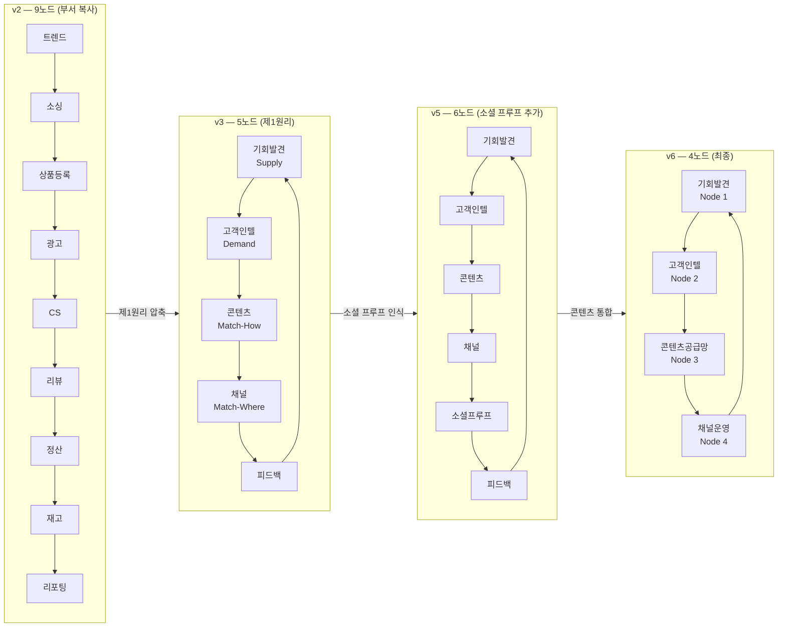
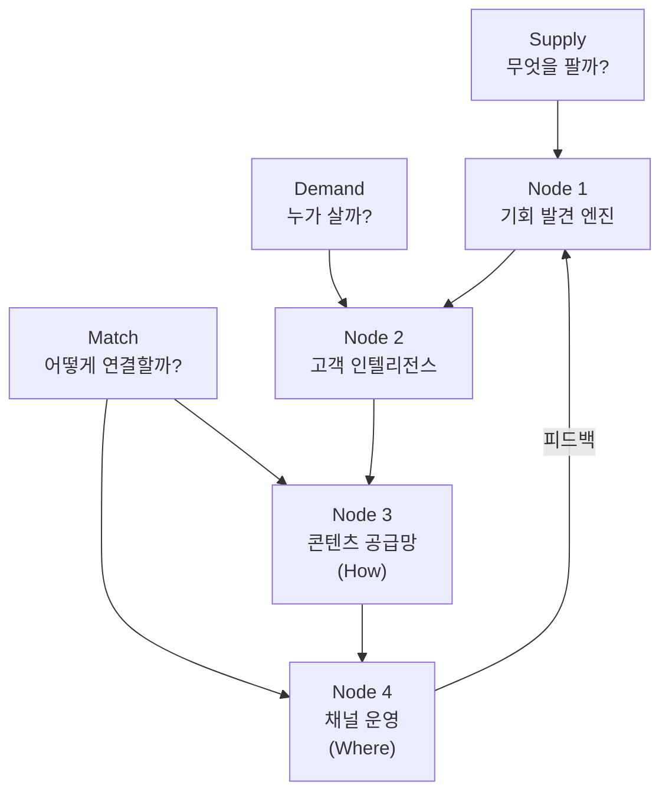

# 설계 철학 (Design Philosophy)

> **TL;DR**
> 1. 이커머스의 본질은 Supply(공급) / Demand(수요) / Match(연결) 3가지뿐이며, 모든 노드는 이 축을 중심으로 설계되었다.
> 2. 버전 진화(v2→v3→v5→v6)는 "부서 모방"에서 "AI 실행 단위"로의 패러다임 전환 과정이다.
> 3. 개별 SaaS는 10x 자동화를, 전체 파이프라인 통합은 24h TTR(Time-to-Revenue)을 통한 100x 가치를 목표로 한다.

---

## 1. 제1원리(First Principles) 사고법 적용

### 1.1 이커머스에서 절대적으로 필요한 것

> "기존 구조를 부수고, 더 이상 나눌 수 없는 진실만 남겨라."

이커머스 비즈니스를 원자 단위로 분해하면 세 가지만 남는다.

| 요소 | 질문 | 핵심 활동 |
|------|------|-----------|
| **Supply** | 무엇을 팔 것인가? | 트렌드 감지, 소싱, 상품 기획 |
| **Demand** | 누가 살 것인가? | 고객 세그먼트, 구매 동기, 가격 민감도 |
| **Match** | 어떻게 연결할 것인가? | 콘텐츠 제작, 채널 배포, 전환 최적화 |

이 세 가지 이외의 모든 활동(정산, 재고, CS 등)은 *운영 지원*이지 가치 창출의 핵심이 아니다. AutoMarket은 이 원칙에서 출발한다.

### 1.2 "부서" 기반 → "의사결정 단위" 기반

사람의 조직은 역할(Role)과 책임(Responsibility)으로 분리된다. 그러나 AI Agent의 실행 단위는 **하나의 의사결정 사이클**이다.

- 기존 접근: 마케팅팀 / 소싱팀 / CS팀 → 부서를 그대로 노드로 복사
- AutoMarket 접근: "이 판단을 내리려면 어떤 인풋이 필요하고, 아웃풋은 무엇인가?" → 의사결정 흐름으로 노드 정의

결과적으로 노드 수는 줄고, 각 노드의 자율성과 책임이 명확해진다.

---

## 2. 아키텍처 진화 과정



### 2.1 v2 (9노드) — 부서 복사의 함정

최초 설계는 기존 이커머스 팀 구조를 그대로 노드로 옮겼다. 문제는 즉시 드러났다.

- **중복**: 트렌드 분석이 소싱 노드와 광고 노드 양쪽에 존재
- **의존성 과다**: 9개 노드가 선형 체인으로 연결 → 하나의 실패가 전체 정지
- **피드백 루프 없음**: 데이터가 한 방향으로만 흐르고, 학습이 불가능

### 2.2 v3 (5노드) — 제1원리 압축

Supply/Demand/Match로 재구성하고, Match를 How(콘텐츠)와 Where(채널)로 분리했다. 피드백 루프를 명시적으로 추가해 학습하는 시스템의 기반을 만들었다.

### 2.3 v5 (6노드) — 소셜 프루프(Social Proof) 인식

v3 검증 과정에서 리뷰와 인플루언서 콘텐츠가 전환율에 미치는 영향이 일반 광고 콘텐츠보다 크다는 데이터를 확인했다. 소셜 프루프를 별도 노드로 분리하여 독립적으로 관리하기 시작했다.

### 2.4 v6 (4노드) — 최종 아키텍처

소셜 프루프와 콘텐츠 제작은 결국 동일한 의사결정 단위("어떤 메시지를 만들 것인가")에 속한다는 것을 깨달았다. 둘을 **콘텐츠 공급망(Content Supply Chain)**으로 통합하여 4노드로 수렴했다. 노드 수가 줄수록 인터페이스가 단순해지고, Agent 간 통신 오류 가능성이 줄어든다.

> 상세 노드 명세는 [02-nodes.md](./02-nodes.md)를 참조한다.

---

## 3. "근본 3요소" 분석 — Supply / Demand / Match



Match를 두 노드로 분리한 이유는 **의사결정의 성격이 다르기** 때문이다.

| 구분 | Node 3 (How) | Node 4 (Where) |
|------|-------------|----------------|
| 질문 | 어떤 메시지/포맷인가? | 어떤 채널/타이밍인가? |
| 인풋 | 고객 인텔리전스, 브랜드 가이드 | 채널 알고리즘, 예산 |
| 아웃풋 | 상세페이지, 숏폼, 리뷰 자산 | 광고 집행, 채널 배포 |
| 실패 비용 | 크리에이티브 재작업 | 예산 낭비 |

---

## 4. AI-네이티브 설계 원칙

### 원칙 1. 의사결정 단위 기준 노드 설계

노드의 경계는 팀이 아닌 **하나의 판단 사이클**이다. 인풋 → 처리 → 아웃풋 → 피드백이 하나의 노드 안에서 닫혀야 한다.

### 원칙 2. 내장 신경계 (Embedded Feedback Loop)

각 노드는 자신의 아웃풋 품질을 스스로 평가하고 다음 실행에 반영한다. 외부 대시보드를 보기 전에, Agent 내부에서 이미 수렴이 일어나야 한다.

### 원칙 3. Trust Escalation (신뢰 기반 자동 승격/롤백)

```
신뢰도 < 70%  →  Human 검토 요청
신뢰도 70~90%  →  자동 실행 + 사후 로그
신뢰도 > 90%  →  완전 자율 실행
```

실패 감지 시 자동 롤백하고 원인 로그를 남긴다. 신뢰도는 히스토리 기반으로 누적 업데이트된다.

### 원칙 4. 사람의 역할 최소화 (3가지만)

| 인간의 의사결정 | 예시 | 이유 |
|----------------|------|------|
| 사업 방향 설정 | 카테고리 진입/철수 | AI가 최적화할 목표 함수 자체 |
| 관계 구축 | 공급처 협상, 인플루언서 계약 | 신뢰는 아직 인간 자산 |
| 위기 대응 | 브랜드 리스크, 법적 이슈 | 판단의 맥락이 너무 복잡 |

---

## 5. 10x vs 100x 가치 포인트

### 10x — 수작업 자동화

각 SaaS가 독립적으로 제공하는 가치다. 사람이 4시간 걸리던 작업을 24분에 처리한다.

| 작업 | 기존 소요 시간 | 자동화 후 |
|------|--------------|-----------|
| 상세페이지 초안 제작 | 4시간 | 20분 |
| 트렌드 리포트 작성 | 3시간 | 15분 |
| 리뷰 분석 및 답변 | 2시간/일 | 5분/일 |
| 광고 소재 A/B 설정 | 2시간 | 10분 |

### 100x — 파이프라인 통합으로 인한 의사결정 속도

개별 10x들이 연결되면 **정보 지연(Information Latency)**이 사라진다. 트렌드 감지 신호가 즉시 콘텐츠 생산으로 이어지고, 채널 성과가 실시간으로 다음 소싱 판단에 반영된다.

> 각 SaaS가 단독으로 10x, 통합 시 100x를 달성한다.

파이프라인 통합이 만드는 핵심 가치는 **24h TTR(Time-to-Revenue)**이다.

---

## 6. Time-to-Revenue (TTR) 개념과 목표

**TTR 정의**: 트렌드 신호 최초 감지 → 해당 상품의 첫 매출 발생까지의 시간

### 목표

| 모드 | 목표 TTR |
|------|---------|
| Autopilot (완전 자율) | 24시간 이내 |
| Human-in-the-loop | 24~48시간 (현실적 목표) |

### 노드별 이론 소요 시간

```mermaid
gantt
    title TTR 이론 분해 (이상적 시나리오)
    dateFormat HH:mm
    axisFormat %H:%M

    section Node 1
    트렌드 감지 + 소싱 결정     :n1, 00:00, 4h

    section Node 2
    고객 세그먼트 분석           :n2, after n1, 1h

    section Node 3
    상세페이지 + 콘텐츠 생성     :n3, after n2, 2h

    section Node 4
    채널 배포 + 광고 집행        :n4, after n3, 1h
```



| 구간 | 소요 시간 |
|------|---------|
| Node 1: 기회 발견 | 4시간 |
| Node 2: 고객 인텔리전스 | 1시간 |
| Node 3: 콘텐츠 생산 | 2시간 |
| Node 4: 채널 배포 | 1시간 |
| **이론적 합계** | **8시간** |

### 갭 분석 (8시간 → 24시간)

실제 TTR이 이론값을 초과하는 원인은 AI가 아니라 **인터페이스 지연**이다.

| 갭 요인 | 예상 지연 |
|--------|---------|
| Human 승인 대기 (Trust Escalation) | 4~8시간 |
| 공급처 재고 확인 응답 | 2~4시간 |
| 쇼핑몰 채널 상품 심사 | 2~4시간 |
| 광고 소재 검수 | 1~3시간 |
| **갭 합계** | **9~19시간** |

> TTR을 단축하는 가장 빠른 방법은 AI를 개선하는 것이 아니라 **Human 승인 임계값을 높이는 것**이다. Trust Escalation 임계값이 올라갈수록 TTR은 이론값에 수렴한다.

---

## 참조 문서

- [02-nodes.md](./02-nodes.md) — 각 노드 상세 명세 (인풋/아웃풋/책임 범위)
- [03-workflows.md](./03-workflows.md) — 노드 간 데이터 흐름 및 워크플로
- [04-trust-escalation.md](./04-trust-escalation.md) — Trust Escalation 정책 상세
- [05-metrics.md](./05-metrics.md) — TTR 측정 방법론 및 KPI 정의
