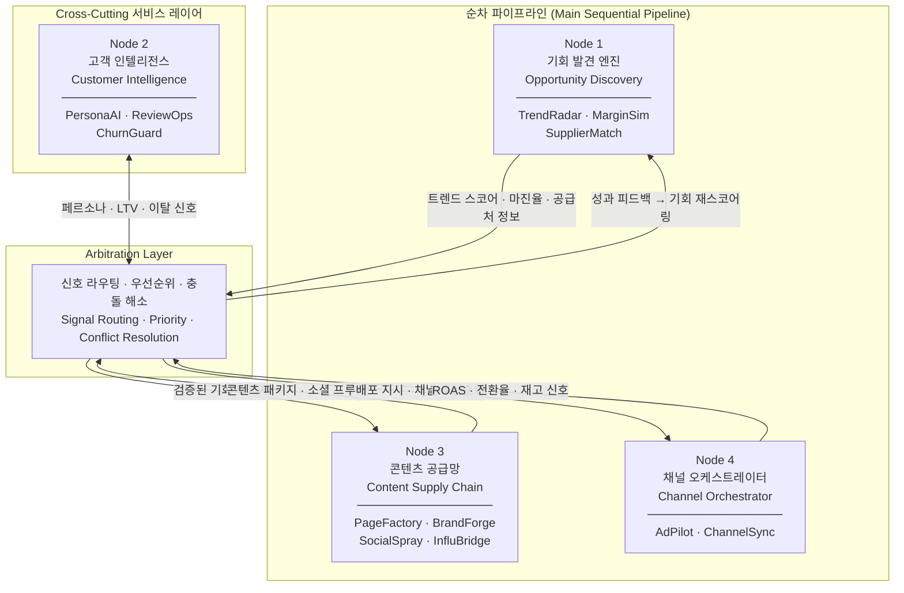
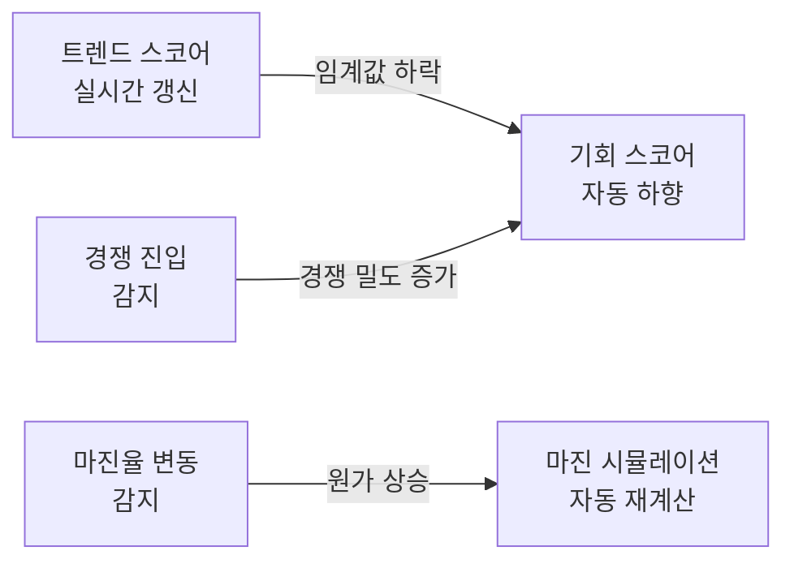
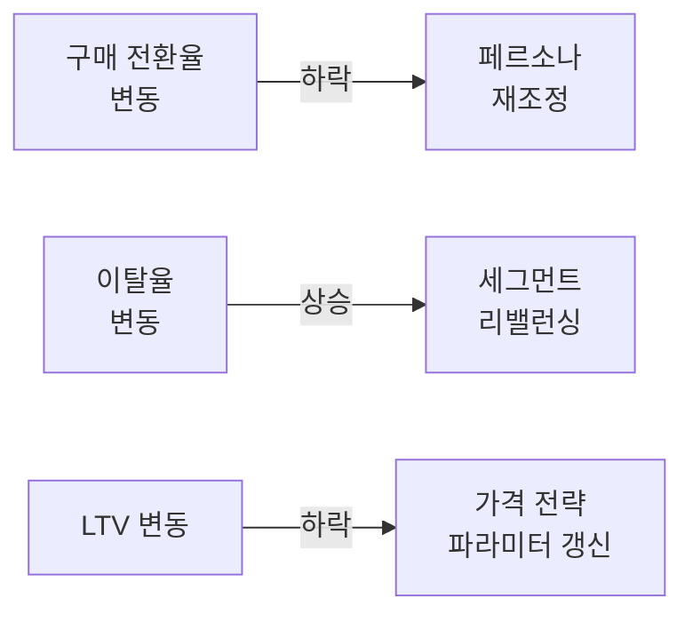
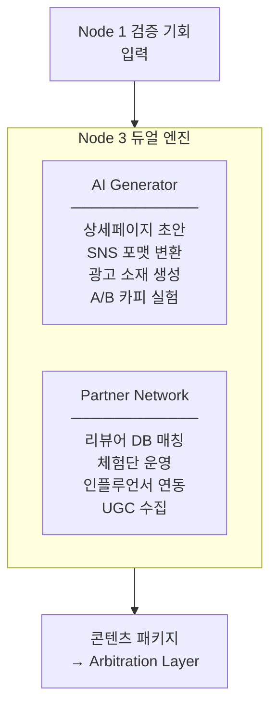
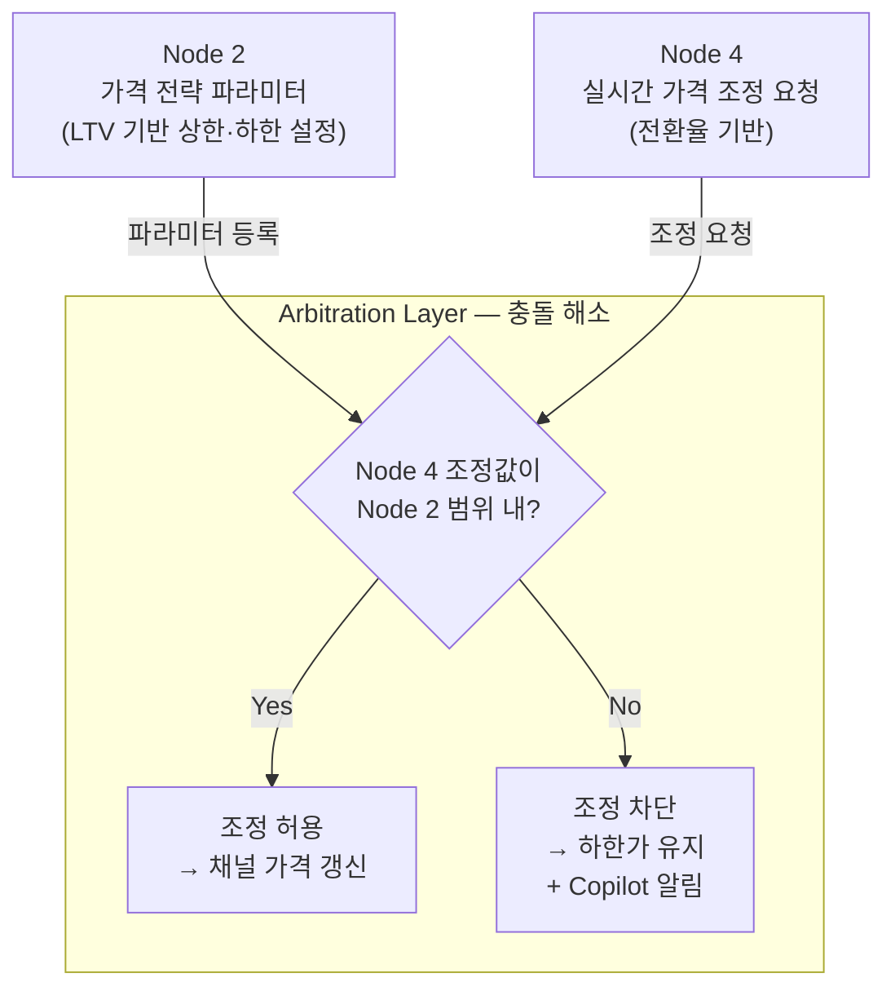
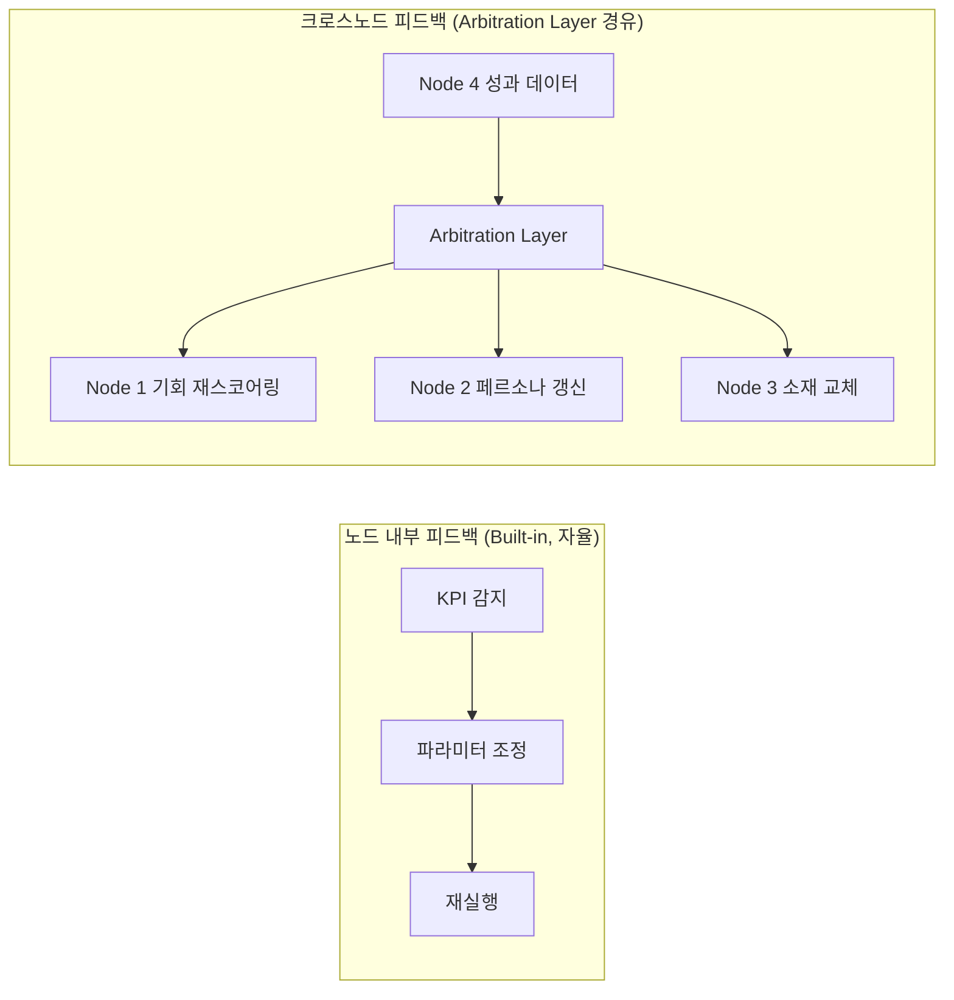

# AutoMarket v6 아키텍처 상세 명세

> **TL;DR**
> 1. 4개 Core Node는 순차 파이프라인(1→3→4)과 cross-cutting 서비스 레이어(Node 2)로 구성되며, Arbitration Layer가 노드 간 신호를 중재한다.
> 2. 각 노드는 내장 신경계(Built-in Neural Net)를 보유해 KPI 변동을 자체 감지하고 내부 파라미터를 자율 조정한다.
> 3. 크로스노드 충돌은 Arbitration Layer가 우선순위 규칙으로 해소하며, 사람은 전략·브랜드·계약 3가지 의사결정에만 개입한다.

---

## 전체 데이터 흐름 (Overall Data Flow)

Node 2는 파이프라인 직렬 구조에 포함되지 않는다. Arbitration Layer를 통해 나머지 3개 노드 모두에 맥락(페르소나, 가격 파라미터, 이탈 위험)을 실시간 주입하는 **cross-cutting 서비스 레이어**로 동작한다.

---

## Node 1 — 기회 발견 엔진 (Opportunity Discovery Engine)

> "What to sell" — 시장 신호 수집 → 상품 후보 추출 → 수익성 검증을 단일 루프로 통합

### 역할 및 v2 통합 영역

| 항목 | 내용 |
|------|------|
| AI 자동화 목표 | 92% (현실적 달성 가능 범위: 70–80%) |
| v2 통합 영역 | 인텔리전스 + 소싱 & 상품기획 + 정산 & 수익분석 |
| TTR (Time-to-Resolution) | 트렌드 감지 → 상품 확정 **4시간** |
| 담당 제품 | TrendRadar, MarginSim, SupplierMatch |

### 3단계 자동화 분류

| 단계 | 업무 |
|------|------|
| Autopilot | 트렌드 크롤링 & 수요 예측, 경쟁사 모니터링, 마진 시뮬레이션, 공급처 자동 매칭 |
| Copilot | 상품 포트폴리오 추천 및 우선순위 제안 |
| Human-led | Go/No-go 최종 결정 & 공급처 계약 체결 |

### 내장 신경계 (Built-in Neural Net)

---

## Node 2 — 고객 인텔리전스 (Customer Intelligence)

> "Who to sell to" — 고객 데이터 + 페르소나 + 브랜드 전략 통합

### 역할 및 v2 통합 영역

| 항목 | 내용 |
|------|------|
| AI 자동화 목표 | 82% (현실적 달성 가능 범위: 65–75%) |
| 아키텍처 위치 | Cross-cutting 서비스 레이어 (비직렬) |
| v2 통합 영역 | 고객 & CRM + 브랜딩 & 전략 |
| TTR | **실시간** (신호 발생 즉시 갱신) |
| 담당 제품 | PersonaAI, ReviewOps, ChurnGuard |

### 3단계 자동화 분류

| 단계 | 업무 |
|------|------|
| Autopilot | 행동 데이터 클러스터링, LTV 예측, 페르소나 자동 생성 |
| Copilot | 타겟 세그먼트 최적화 제안 |
| Human-led | 브랜드 포지셔닝 · 톤앤매너 결정 |

### 내장 신경계

---

## Node 3 — 콘텐츠 공급망 (Content Supply Chain)

> "How to present & trust" — 내부 AI 생산 + 외부 파트너 네트워크 통합

### 역할 및 v2 통합 영역

| 항목 | 내용 |
|------|------|
| AI 자동화 목표 | 78% (현실적 달성 가능 범위: 60–70%) |
| v2 통합 영역 | 콘텐츠 생산 + 소셜 프루프 엔진 |
| TTR | 상품 확정 → 콘텐츠 완성 **2시간** |
| 담당 제품 | PageFactory, BrandForge, SocialSpray, InfluBridge |

### 듀얼 엔진 구조

### 3단계 자동화 분류

| 단계 | 업무 |
|------|------|
| Autopilot | 상세페이지 초안 생성, SNS 포맷 변환, 광고 소재 A/B 실험, 리뷰어 자동 매칭 |
| Copilot | 콘텐츠 품질 검수 제안, 인플루언서 후보 선정 |
| Human-led | 최종 소재 승인, 파트너 계약 |

### 내장 신경계

- 클릭률(CTR) 하락 감지 → 광고 소재 자동 교체
- 리뷰 감성(Sentiment) 악화 → 체험단 증원 요청
- 인플루언서 ROI 저하 → 예산 리밸런싱

---

## Node 4 — 채널 오케스트레이터 (Channel Orchestrator)

> "Where to reach" — 유통 채널 + 마케팅 자동화 통합 실행

### 역할 및 v2 통합 영역

| 항목 | 내용 |
|------|------|
| AI 자동화 목표 | 85% (현실적 달성 가능 범위: 75–85%) |
| v2 통합 영역 | 유통 & 채널 + 마케팅 자동화 |
| TTR | 콘텐츠 완성 → 채널 라이브 **1시간** |
| 담당 제품 | AdPilot, ChannelSync |

### 3단계 자동화 분류

| 단계 | 업무 |
|------|------|
| Autopilot | 채널별 상품 등록·동기화, 광고 예산 실시간 배분, 입찰가 자동 조정 |
| Copilot | 채널 믹스 전략 제안, 예산 시나리오 비교 |
| Human-led | 예산 총량 결정, 신규 채널 진입 승인 |

### 내장 신경계

- ROAS 하락 감지 → 채널 예산 자동 리밸런싱
- 재고 부족 신호 수신 → 해당 채널 광고 일시 중단
- 전환율 변동 → 가격 조정 요청 (Arbitration Layer 경유)

---

## Arbitration Layer — 충돌 해소 메커니즘

Node 2와 Node 4 간에는 **가격 조정 충돌**이 발생한다. Node 4는 채널별 전환율 기반으로 실시간 가격을 낮추려 하고, Node 2는 LTV 보호 관점에서 가격 하한을 유지하려 한다.

**우선순위 규칙 요약**

| 조건 | 결과 |
|------|------|
| Node 4 조정값 ≥ Node 2 하한가 | 허용 — Node 4 실행 |
| Node 4 조정값 < Node 2 하한가 | 차단 — 하한가 유지, Copilot 개입 요청 |
| Node 4 조정값 > Node 2 상한가 | 차단 — 상한가 유지 |

---

## 피드백 순환 구조 (Feedback Loop Architecture)

### 설계 원칙

- **내장형 피드백**: 각 노드는 자신의 KPI 변동을 독립적으로 감지하고 내부 파라미터를 조정한다. 외부 조율 없이 동작하므로 응답 속도가 빠르다 (초~분 단위).
- **크로스노드 피드백**: 노드 경계를 넘는 신호는 반드시 Arbitration Layer를 경유한다. 이로써 충돌·루프·우선순위 역전을 방지한다.
- **대시보드의 역할**: 중앙 대시보드는 전체 파이프라인을 **관찰(Observe)**하는 도구다. 의사결정 주체가 아니며, 파이프라인 흐름을 직접 제어하지 않는다. 이상 감지 시 Copilot 알림을 사람에게 전달하는 역할에 그친다.

---

## 노드별 핵심 지표 요약

| Node | AI 자동화 (목표) | 현실 범위 | TTR | 핵심 KPI |
|------|-----------------|-----------|-----|---------|
| 1 — 기회 발견 | 92% | 70–80% | 4h | 트렌드 스코어, 마진율, 기회 확정 수 |
| 2 — 고객 인텔리전스 | 82% | 65–75% | 실시간 | LTV, 이탈율, 페르소나 정확도 |
| 3 — 콘텐츠 공급망 | 78% | 60–70% | 2h | CTR, 소재 교체 주기, 리뷰 감성 점수 |
| 4 — 채널 오케스트레이터 | 85% | 75–85% | 1h | ROAS, 채널별 전환율, 광고 중단율 |

---

## 관련 문서 (Related Documents)

| 문서 | 설명 |
|------|------|
| [./00-overview.md](./00-overview.md) | 플랫폼 총괄 개요 및 Executive Summary |
| [./01-philosophy.md](./01-philosophy.md) | 제1원리 사고 과정 및 v2→v6 아키텍처 진화 |
| [./03-products.md](./03-products.md) | 12개 SaaS 제품 개별 스펙 |
| [./04-automation.md](./04-automation.md) | 3단계 자동화 모델 및 Arbitration Layer 설계 상세 |
| [./05-roadmap.md](./05-roadmap.md) | 단계별 실행 계획 및 성공 지표 |
