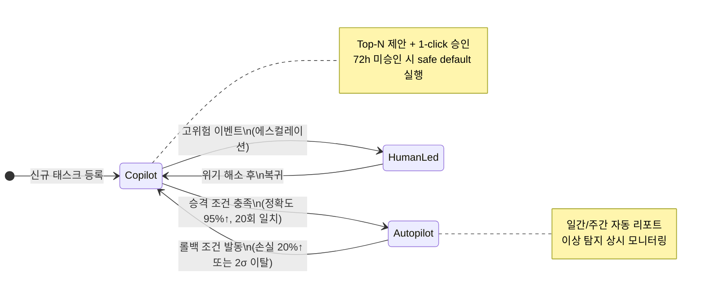

# 03. AI 자동화 & Human-in-the-Loop 설계

> 관련 문서: [00-overview.md](./00-overview.md)

---

## TL;DR

- 모든 작업을 **Autopilot(60%) / Copilot(25%) / Human-led(15%)** 3단계로 분류하여 운영한다.
- AI 정확도와 손실 이력에 따라 자동화 레벨이 자동 승격/롤백되는 **Trust Escalation Model**을 적용한다.
- 사람은 사업 방향 결정, 관계 구축, 위기 대응의 3가지 영역에 집중한다.

---

## 1. 자동화 3단계 레벨 정의

| 레벨 | 비중 | 주도 | 사람 역할 |
|------|------|------|-----------|
| Autopilot | ~60% | AI 전담 실행 | 사후 리포트 검토 |
| Copilot | ~25% | AI 제안, 사람 승인 | 1-click 승인/거절/수정 |
| Human-led | ~15% | 사람 결정 | AI는 데이터 수집·분석 보조 |

---

### 1-1. Autopilot (~60%)

AI가 사람 개입 없이 자율 실행하는 영역이다.

**진입 조건**
- AI 예측 정확도 95% 이상 연속 유지
- 단일 실행의 손실 위험이 사전 정의 임계값 이하

**모니터링**
- 모든 실행 결과 자동 로깅 (타임스탬프, 입력값, 출력값, 소요 시간)
- 이상 탐지(anomaly detection) 발동 시 즉시 Slack/이메일 알림
- 정상 패턴에서 2 표준편차 이상 이탈 시 Copilot으로 자동 강등

**사후 보고**
- 일간 자동 리포트: 실행 건수, 성공률, 주요 지표 변화
- 주간 자동 리포트: 누적 성과, 주요 의사결정 로그, 이상 이벤트 요약

**대표 태스크**

| 태스크 | 설명 |
|--------|------|
| 트렌드 크롤링 | 키워드·카테고리 트렌드 자동 수집·정리 |
| 상세페이지 생성 | 상품 데이터 기반 LLM 초안 생성 |
| 광고 예산 배분 | ROAS 데이터 기반 캠페인별 예산 자동 조정 |
| 재고-광고 연동 | 재고 수준에 따라 광고 on/off 자동 전환 |

---

### 1-2. Copilot (~25%)

AI가 Top-N 옵션을 제안하고 사람이 최종 선택하는 영역이다.

**AI 제안 형식**
- Top-N 옵션 (기본 3개) 제시
- 각 옵션에 대해 예상 결과, 예상 리스크, 신뢰도 점수 병기

**사람 승인 UX**
- 대시보드에서 1-click 승인 / 거절 / 수정 후 승인
- 모바일 푸시 알림 연동으로 즉시 처리 가능

**타임아웃 처리**
- 24시간 내 미승인: 담당자에게 재알림 발송
- 72시간 내 미승인: 사전 정의된 안전한 기본값(safe default)으로 자동 실행, 이력 기록

**대표 태스크**

| 태스크 | 설명 |
|--------|------|
| 상품 포트폴리오 추천 | 신규 소싱 후보 Top-N 제안 |
| 타겟 세그먼트 최적화 | 광고 타겟 조합 추천 |
| 인플루언서 후보 추천 | 협업 후보 리스트 + 예상 ROI |
| 프로모션 전략 | 할인 구조·기간 옵션 제안 |

---

### 1-3. Human-led (~15%)

사람이 최종 결정권을 가지며 AI는 데이터 수집·분석을 보조하는 영역이다.

**AI 보조 방식**
- 의사결정에 필요한 데이터 자동 수집 및 정리
- 선택지별 영향 범위 시뮬레이션 제공
- 과거 유사 결정의 결과 데이터 조회 지원

**대표 태스크**

| 태스크 | 설명 |
|--------|------|
| Go/No-go 결정 | 신규 카테고리·채널 진입 여부 |
| 브랜드 포지셔닝 | 브랜드 메시지·가격대 설정 |
| 인플루언서 파트너십 협상 | 장기 계약 조건 확정 |
| 신규 채널 진입 | 플랫폼·마켓 확장 결정 |

---

## 2. Trust Escalation Model

자동화 레벨은 고정이 아니다. AI 성과와 리스크 이력에 따라 동적으로 조정된다.

### 상태 전이도

---

### 2-1. 승격 조건 (Copilot → Autopilot)

| 조건 | 기준값 |
|------|--------|
| AI 제안과 사람 판단 일치 횟수 | 연속 20회 이상 |
| 예측 정확도 | 95% 이상 유지 |
| 롤백 이력 | 최근 30일 내 없음 |

**승격 프로세스**
1. 시스템이 조건 충족 감지 → 관리자에게 승격 제안 알림 발송
2. 관리자 확인 및 최종 승인
3. 해당 태스크 Autopilot으로 전환, 이력 기록

---

### 2-2. 롤백 조건 (Autopilot → Copilot)

| 조건 | 기준값 |
|------|--------|
| 단일 작업 손실 | 예상 대비 20% 초과 |
| 패턴 이탈 | 정상 분포에서 2σ 초과 |
| 연속 실패 | 3회 연속 목표 미달 |

**롤백 프로세스**
1. 임계값 초과 즉시 해당 태스크 Copilot으로 자동 강등
2. 원인 분석 리포트 자동 생성 (이상 발생 시각, 입력값, 출력값, 편차)
3. 담당자 알림 발송
4. 재승격을 위한 일치 횟수 카운터 리셋

---

### 2-3. 승격·롤백 로그 관리

- 모든 승격·롤백 이력 영구 보관 (타임스탬프, 사유, 담당자)
- 태스크별 자동화 레벨 변경 히스토리 대시보드 제공
- 월간 Trust Escalation 리포트 자동 생성

---

## 3. 사람의 3가지 의사결정 영역

### 3-1. 사업 방향 결정

| 항목 | 내용 |
|------|------|
| 발생 시점 | 신규 카테고리 진입, 기존 카테고리 철수, 사업 피벗 |
| AI 지원 데이터 | 시장 기회 스코어, 경쟁 강도 지수, 예상 ROI 시뮬레이션 |
| 트리거 | 기회 스코어 급등/급락, 경쟁 환경 변화 이상 탐지 시 에스컬레이션 |

---

### 3-2. 관계 구축

| 항목 | 내용 |
|------|------|
| 발생 시점 | 핵심 공급처 신규 계약, 인플루언서 장기 파트너십, 전략적 제휴 체결 |
| AI 지원 데이터 | 파트너 평가 스코어, 협상 시나리오별 예상 조건, 유사 사례 결과 |
| 트리거 | 공급처 매칭 완료 알림, 인플루언서 ROI 상위 N% 진입 감지 |

---

### 3-3. 위기 대응

| 항목 | 내용 |
|------|------|
| 발생 시점 | 플랫폼 정책 변경, 공급 중단, PR 위기, 예측 불가 외부 충격 |
| AI 지원 데이터 | 영향 범위 자동 분석, 대응 시나리오 생성, 예상 손실 규모 추정 |
| 트리거 | 이상 탐지 시스템이 사람 에스컬레이션 플래그 발동 |

---

## 4. 운영 가이드 (Operations Runbook) 요약

### Trust Escalation 이벤트 행동 지침

| 이벤트 | 운영팀 액션 |
|--------|-------------|
| 승격 제안 수신 | 24시간 내 히스토리 검토 후 승인/거부 |
| 롤백 알림 수신 | 원인 분석 리포트 확인 → 재발 방지 조치 → 카운터 리셋 확인 |
| 72h 타임아웃 발동 | safe default 실행 이력 검토, 담당자 재배정 검토 |
| 사람 에스컬레이션 | 30분 내 초기 대응, 4시간 내 대응 방향 확정 |

### 장애 대응 (노드별 Fallback 전략)

| 노드 | 장애 시 Fallback |
|------|-----------------|
| 크롤링 에이전트 | 마지막 성공 데이터 캐시 사용, 수동 수집 알림 |
| LLM 생성 에이전트 | 템플릿 기반 초안 생성으로 전환 |
| 광고 최적화 에이전트 | 전일 예산 배분 유지, Copilot으로 강등 |
| 재고 연동 에이전트 | 광고 일시 정지 후 수동 확인 요청 |

### 자동화 레벨 모니터링 체크리스트

- [ ] 일간: Autopilot 태스크 성공률 95% 이상 유지 확인
- [ ] 일간: 이상 탐지 알림 미처리 건 없음 확인
- [ ] 주간: Trust Escalation 이벤트 로그 검토
- [ ] 주간: Copilot 타임아웃 발동 건 원인 분석
- [ ] 월간: Trust Escalation 리포트 검토 및 임계값 재조정 검토

---

*이 문서는 자동화 설계의 운영 기준을 정의한다. 시스템 아키텍처 세부 사항은 [00-overview.md](./00-overview.md)를 참조한다.*
