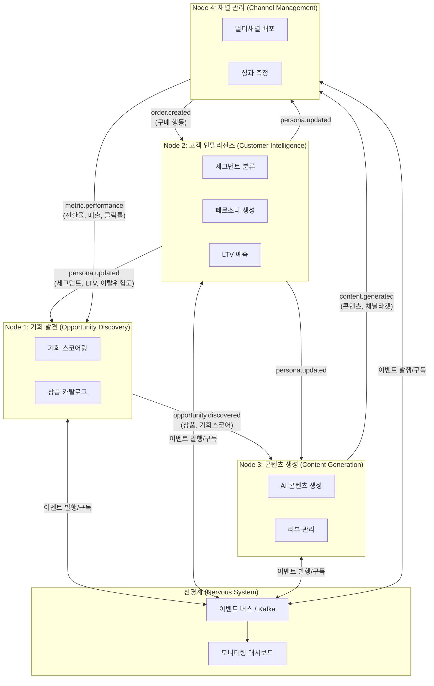
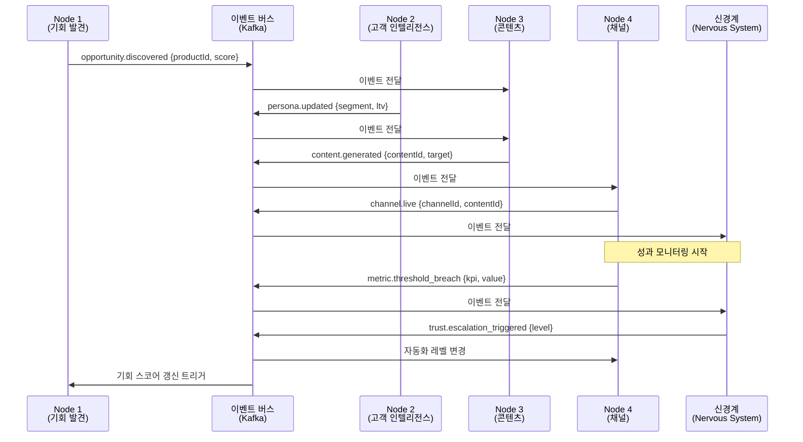
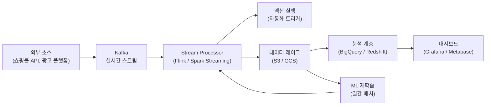

# 05. 데이터 아키텍처 & 통합 설계 (Data Architecture & Integration Design)

> **TL;DR**
> - 4개 노드는 공통 도메인 엔티티(상품, 고객, 주문, 콘텐츠, 리뷰)를 공유하며, 이벤트 버스를 통해 느슨하게 결합된다.
> - 메인 파이프라인은 Node 1(기회 발견) → Node 3(콘텐츠) → Node 4(채널) 방향이며, Node 4의 성과 데이터는 Node 1로 역방향 피드백된다.
> - 실시간 스트림(Kafka)과 배치 처리를 혼합하여 신경계(Nervous System)가 전체 시스템을 조율한다.

---

관련 문서: [00. 개요](./00-overview.md) | [02. 시스템 아키텍처](./02-architecture.md) | [03. 자동화 설계](./03-automation-design.md) | [04. SaaS 제품](./04-saas-products.md)

---

## 1. 노드 간 데이터 흐름 (Inter-Node Data Flow)

### 메인 파이프라인



**흐름 요약:**
- **순방향**: 기회 발견 → 콘텐츠 생성 → 채널 배포
- **Cross-cutting**: Node 2가 모든 노드에 페르소나/세그먼트 데이터 제공
- **역방향 피드백**: Node 4 성과 지표가 Node 1의 기회 스코어를 갱신하고, 구매 행동이 Node 2의 고객 모델을 업데이트

---

## 2. 공통 데이터 모델 (Core Entities)

| 엔티티 | 주요 속성 | 소유 노드 | 소비 노드 |
|--------|-----------|-----------|-----------|
| 상품 (Product) | ID, 이름, 카테고리, 기회스코어, 마진율 | Node 1 | Node 3, 4 |
| 고객 (Customer) | ID, 세그먼트, 페르소나, LTV, 이탈위험도 | Node 2 | Node 3, 4 |
| 주문 (Order) | ID, 상품, 고객, 채널, 금액, 일시 | Node 4 | Node 1, 2 |
| 콘텐츠 (Content) | ID, 유형, 상품, 채널, 클릭률, 전환율 | Node 3 | Node 4 |
| 리뷰 (Review) | ID, 상품, 작성자, 품질스코어, 감성점수 | Node 3 | Node 1, 2 |

각 엔티티는 UUID 기반 식별자를 사용하고, PostgreSQL에 저장된다. 노드 간 참조는 ID만 공유하며, 실제 데이터는 소유 노드의 서비스를 통해 조회한다(서비스 경계 유지).

---

## 3. API 설계 원칙 (API Design Principles)

SaaS 간 통합은 **RESTful API + Event-driven messaging 하이브리드** 방식을 채택한다.

- **API Gateway**: 외부 SaaS 간 통신은 중앙 Gateway를 경유하여 인증, 라우팅, Rate Limiting 일괄 처리
- **내부 노드 간**: 이벤트 버스(Kafka / Redis Streams)를 통한 비동기 메시징
- **인증**: SaaS 간 → API Key, 사용자 인증 → OAuth 2.0 / JWT
- **버전 관리**: URL 기반 (`/api/v1/`, `/api/v2/`)
- **Rate Limiting**: 구독 티어별 차등 적용 (Starter / Growth / Enterprise)

```
GET  /api/v1/products/{id}/opportunity-score
POST /api/v1/events/publish
GET  /api/v1/customers/{id}/persona
POST /api/v1/content/generate
GET  /api/v1/channels/{id}/performance
```

---

## 4. 이벤트 기반 아키텍처 (Event-Driven Architecture)

신경계([03. 자동화 설계](./03-automation-design.md) 참조)는 이벤트 버스 위에서 동작한다.

### 이벤트 분류

| 분류 | 이벤트명 | 발행 노드 | 구독 노드 |
|------|----------|-----------|-----------|
| 도메인 | `opportunity.discovered` | Node 1 | Node 3 |
| 도메인 | `persona.updated` | Node 2 | Node 1, 3, 4 |
| 도메인 | `content.generated` | Node 3 | Node 4 |
| 도메인 | `channel.live` | Node 4 | 신경계 |
| 피드백 | `metric.threshold_breach` | Node 4 | 신경계 |
| 피드백 | `trust.escalation_triggered` | 신경계 | 모든 노드 |
| 알림 | `review.quality_alert` | Node 3 | Node 1, 운영자 |

### 이벤트 흐름 시퀀스



---

## 5. 데이터 파이프라인 설계 (Data Pipeline Design)



- **실시간 스트림**: Kafka → Stream Processor → 즉각 액션 (수초 이내)
- **배치 처리**: 일간 집계, ML 모델 재학습 (자정 ~ 새벽 4시)
- **데이터 레이크**: S3/GCS에 파티션별(날짜/노드) 원본 보관
- **분석 계층**: BigQuery/Redshift에서 집계 후 대시보드 제공

---

## 6. 기술 스택 (Technology Stack)

| 계층 | 기술 | 용도 |
|------|------|------|
| API | FastAPI / Node.js | REST + WebSocket |
| 메시징 | Kafka / Redis Streams | 이벤트 버스 |
| DB | PostgreSQL | 트랜잭션 데이터 |
| 캐시 | Redis | 실시간 스코어, 세션 |
| ML | Python + scikit-learn / PyTorch | 예측 모델 (LTV, 이탈, 기회 스코어) |
| LLM | Claude API / OpenAI | 콘텐츠 생성, 리뷰 분석 |
| 스토리지 | S3 / GCS | 이미지, 데이터 레이크 |
| 모니터링 | Prometheus + Grafana | 신경계 대시보드 |

---

## 7. 개인정보 보호 & 데이터 거버넌스 (Privacy & Data Governance)

**법적 근거**: 개인정보보호법(PIPA), 전자상거래 등에서의 소비자보호에 관한 법률 준수

### 보안 원칙
- **암호화**: 전송 중(TLS 1.3), 저장 중(AES-256) 모두 적용
- **접근 권한**: RBAC(Role-Based Access Control) — 노드별 서비스 계정, 최소 권한 원칙
- **동의 관리**: 수집 항목별 동의 기록, 철회 즉시 처리

### 데이터 보존 정책

| 데이터 유형 | 보존 기간 | 근거 |
|-------------|-----------|------|
| 주문/거래 기록 | 5년 | 전자상거래법 |
| 고객 행동 데이터 | 1년 | 서비스 개선 목적 |
| 마케팅 콘텐츠 | 서비스 종료 시 | 저작권 관리 |
| 시스템 로그 | 6개월 | 보안 감사 |

### 삭제 요청 처리 프로세스
1. 삭제 요청 수신 → 고객 ID 확인
2. 모든 노드 DB에서 개인 식별 정보 삭제 또는 익명화
3. 데이터 레이크의 원본 파티션 삭제
4. 처리 완료 확인서 발급 (30일 이내)

> 익명화된 집계 통계 데이터(개인 재식별 불가)는 보존 가능

---

*다음 문서: [06. 운영 & 모니터링](./06-operations.md) (예정)*
