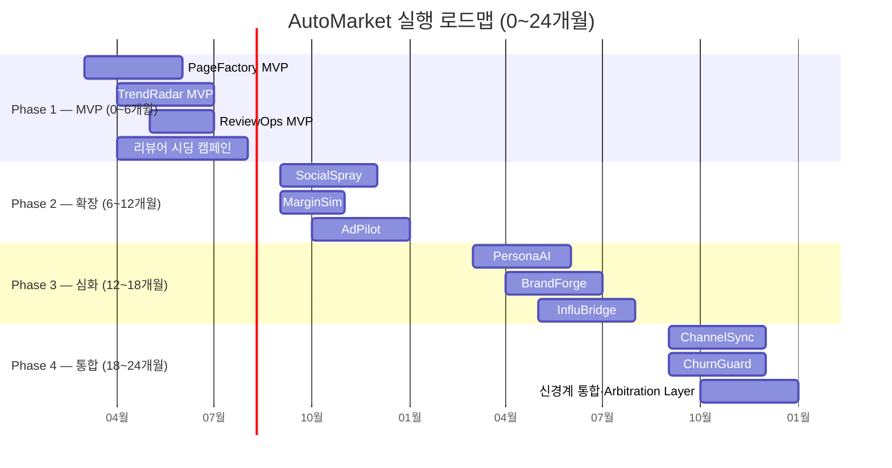
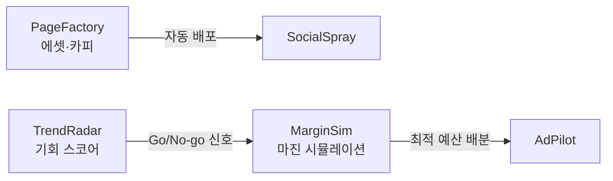
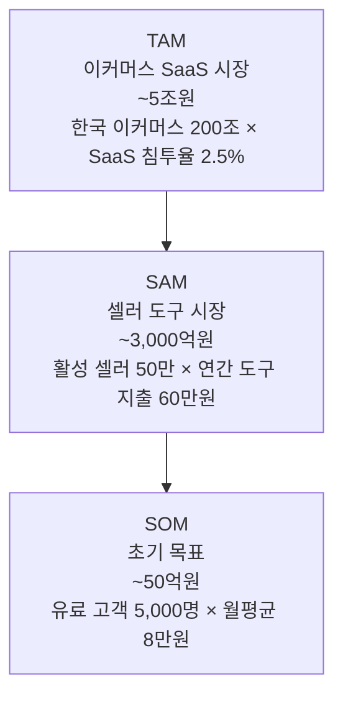
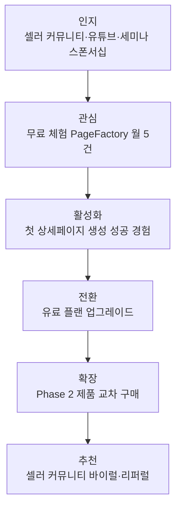

# 06. 실행 로드맵 & GTM 전략 (Execution Roadmap & Go-to-Market Strategy)

> **관련 문서**: [01. 서비스 개요](./01-overview.md) | [02. 제품 카탈로그](./02-products.md) | [03. 시스템 아키텍처](./03-architecture.md) | [04. 데이터 모델](./04-data-model.md) | [05. API 설계](./05-api-design.md)

---

## TL;DR

1. **Phase 1~2 (0~12개월)**: PageFactory · TrendRadar · ReviewOps로 즉시 수익화 가능한 MVP를 출시하고, Phase 2에서 SocialSpray · MarginSim · AdPilot로 확장해 MAU 5,000·MRR 5,000만원을 달성한다.
2. **Phase 3~4 (12~24개월)**: Phase 1~2에서 축적된 10,000건 이상의 주문 데이터를 기반으로 PersonaAI · BrandForge · InfluBridge를 고도화하고, ChannelSync · ChurnGuard로 신경계(Arbitration Layer) 통합 완성 및 전체 자동화율 75%+를 달성한다.
3. **GTM 핵심**: 무료 체험 → 셀러 커뮤니티 마케팅 → 파트너십 채널 순서로 초기 고객을 확보하며, ReviewOps는 기존 체험단 카페 시딩으로 콜드 스타트를 해결한다.

---

## Phase별 상세 계획

### Gantt 타임라인

---

### Phase 1 — MVP (0~6개월)

**목표**: 수익 창출 가능한 핵심 3개 제품 출시, 초기 사용자 베이스 확보

#### 제품별 범위

| 제품 | 핵심 기능 | 비고 |
|------|-----------|------|
| **PageFactory** | 상품 정보 입력 → AI 상세페이지 생성, 3개 템플릿, 채널별 최적화 | 무료 월 5건 포함 |
| **TrendRadar** | 네이버/쿠팡 트렌드 크롤링, 키워드 수요 예측, 기회 스코어링 | 유료 전환 5% 목표 |
| **ReviewOps** | 리뷰어 DB 구축, 체험단 모집/관리, 품질 스코어링 | 리뷰어 DB 5,000명 목표 |

#### ReviewOps 초기 시딩 전략 (Cold Start 해결)

ReviewOps는 리뷰어 DB 규모가 서비스 가치를 결정하는 닭-달걀 문제를 안고 있다. 아래 3단계로 콜드 스타트를 해결한다.

1. **커뮤니티 리크루팅**: 네이버 카페(체험단, 블로거 모집 카페) 및 맘카페에서 리뷰어 모집 캠페인 운영. 초기 3개월간 무료 체험단 신청 혜택 제공.
2. **무료 체험 제공**: 초기 입점 셀러에게 체험단 3건 무료 제공 → 리뷰어와 셀러 동시 유인.
3. **마케팅 대행사 파트너십**: 기존 체험단 DB를 보유한 마케팅 대행사와 제휴, DB 마이그레이션 및 공동 운영으로 초기 규모 확보.

#### Phase 1 KPI

| 지표 | 목표값 |
|------|--------|
| PageFactory MAU | 1,000명+ |
| TrendRadar 유료 전환율 | 5%+ |
| ReviewOps 리뷰어 DB | 5,000명+ |

#### Phase 1 체크리스트

- [ ] PageFactory: LLM 프롬프트 엔지니어링 및 3개 템플릿 설계 완료
- [ ] PageFactory: 채널별(쿠팡/네이버/스마트스토어) 출력 최적화 검증
- [ ] TrendRadar: 네이버 DataLab · 쿠팡 크롤러 안정화 (일 1회 이상 수집)
- [ ] TrendRadar: 키워드 수요 예측 모델 초기 정확도 70%+ 달성
- [ ] ReviewOps: 리뷰어 온보딩 플로우 및 품질 스코어링 알고리즘 배포
- [ ] ReviewOps: 마케팅 대행사 파트너십 계약 2건 이상 체결
- [ ] 결제 시스템 (PG 연동) 및 구독 관리 기능 구현
- [ ] 공통 인증/권한 서비스 (IAM) 운영 환경 배포

---

### Phase 2 — 확장 (6~12개월)

**목표**: Phase 1 데이터를 레버리지로 신규 3개 제품 출시, MRR 5,000만원 달성

#### Phase 1 데이터 연계 흐름

- **SocialSpray**: PageFactory에서 생성된 상품 에셋(이미지·카피)을 SNS 채널별로 자동 재가공 후 스케줄 배포
- **MarginSim**: TrendRadar 기회 스코어를 입력받아 소싱 단계에서 마진 시뮬레이션 및 Go/No-go 판단 지원
- **AdPilot**: MarginSim 마진 데이터를 기반으로 광고 예산 자동 배분 및 입찰가 최적화

#### Phase 2 KPI

| 지표 | 목표값 |
|------|--------|
| 전체 MAU | 5,000명+ |
| MRR | 5,000만원+ |
| Phase 1→2 교차 사용률 | 30%+ |

---

### Phase 3 — 심화 (12~18개월)

**목표**: 축적 데이터 기반 AI 고도화, 인플루언서 생태계 연결

**전제 조건**: Phase 1~2에서 최소 **10,000건 이상의 주문/캠페인 데이터** 축적이 PersonaAI 정확도와 InfluBridge ROI 예측의 기반이 된다. 데이터가 미달될 경우 Phase 3 출시 일정을 조정한다.

| 제품 | 의존 데이터 | 목표 KPI |
|------|-------------|---------|
| **PersonaAI** | 구매 이력·행동 패턴 10,000건+ | 페르소나 정확도 80%+ |
| **BrandForge** | 브랜드별 카피·에셋 히스토리 | 브랜드 일관성 스코어 도입 |
| **InfluBridge** | ReviewOps 리뷰어 성과 데이터 | 인플루언서 매칭 ROI 3x+ |

---

### Phase 4 — 통합 (18~24개월)

**목표**: 전체 신경계(Nervous System) 완성, 자동화율 75%+ 달성

**신경계 구현 핵심**:
- 모든 노드(제품 모듈) 간 이벤트 버스(Kafka) 연결 완성
- **Arbitration Layer** 가동: 복수 모듈이 경합하는 의사결정을 중재하고 최적 액션 자동 실행
- ChurnGuard: 이탈 예측 신호를 감지해 리텐션 액션을 자동 트리거
- ChannelSync: 전 채널 재고·가격·콘텐츠를 단일 진실의 원천(Single Source of Truth)으로 동기화

| 지표 | 목표값 |
|------|--------|
| TTR (Time-to-Response) | 24시간 이내 |
| 전체 자동화율 | 75%+ |
| 월간 이탈율 | 3% 이하 |

---

## Go-to-Market 전략

### 타겟 시장 규모 (TAM · SAM · SOM)

| 구분 | 규모 | 근거 |
|------|------|------|
| TAM | 약 5조원 | 한국 이커머스 시장 200조 × SaaS 침투율 2.5% |
| SAM | 약 3,000억원 | 활성 셀러 50만 × 연간 도구 지출 60만원 |
| SOM | 약 50억원 | Phase 1~2 유료 고객 5,000명 × 월평균 8만원 |

### 초기 고객 획득 퍼널 (GTM Funnel)

**채널별 전술**:
- **셀러 커뮤니티 마케팅**: 네이버 카페(스마트스토어 셀러 커뮤니티), 유튜브 이커머스 채널 협찬
- **이커머스 교육/세미나 스폰서십**: 셀러 대상 오프라인·온라인 세미나 후원 및 데모 시연
- **무료 체험 전환**: PageFactory 월 5건 무료 → 한계 도달 시 유료 전환 유도
- **파트너 채널**: 마케팅 대행사 리셀러 계약, 물류·풀필먼트 업체 번들링 패키지

### 가격 전략

| 제품 | 모델 | 가격대 |
|------|------|--------|
| PageFactory | 프리미엄 (Freemium) | 무료 (월 5건) ~ 월 9.9만원 |
| TrendRadar | 구독 3티어 | 월 9.9만 / 29.9만 / 99만원 |
| ReviewOps | 트랜잭션 (Transaction) | 체험단 건당 수수료 (캠페인 규모 연동) |
| SocialSpray | 구독 | 월 19.9만원~ |
| MarginSim | 구독 | 월 4.9만원~ |
| AdPilot | 성과 기반 (% of spend) | 광고비의 2~5% |

### 파트너십 전략

| 파트너 유형 | 구체적 연계 방안 |
|-------------|-----------------|
| 쿠팡/네이버 셀러 지원 프로그램 | 공식 파트너 등록, 셀러 대시보드 내 노출 |
| 마케팅 대행사 리셀러 | ReviewOps DB 제휴 + 리셀러 마진 20~30% 제공 |
| 물류·풀필먼트 업체 | MarginSim 연동 번들 패키지 (셀러 원스톱 지원) |

---

## 리소스 계획

### Phase 1 팀 구성 (4~6인)

| 역할 | 인원 | 핵심 역량 |
|------|------|-----------|
| 풀스택 개발 | 2명 | Node.js / React + Python |
| ML 엔지니어 | 1명 | 크롤링, 예측 모델, LLM 파인튜닝 |
| 프로덕트 매니저 | 1명 | 이커머스 도메인 이해, 셀러 UX |
| 디자이너 | 0.5명 | UI/UX (파트타임 or 프리랜서) |
| 마케팅 | 0.5명 | 셀러 커뮤니티 운영, 콘텐츠 마케팅 |

### 기술 스택 (Tech Stack)

| 레이어 | 기술 |
|--------|------|
| 백엔드 API | Node.js (NestJS) + FastAPI (ML 서비스) |
| 데이터베이스 | PostgreSQL (운영 DB) + Redis (캐시) |
| 이벤트 버스 | Kafka (Phase 4 신경계 통합) |
| 프론트엔드 | React + TypeScript |
| AI/LLM | LLM API (OpenAI / Anthropic Claude) + 자체 파인튜닝 모델 |
| 인프라 | AWS (ECS/RDS/ElastiCache) + Terraform |
| 모니터링 | Datadog + Sentry |

> 상세 아키텍처는 [03. 시스템 아키텍처](./03-architecture.md) 참조.

---

## 실행 체크리스트 (전체)

### Phase 1 완료 기준
- [ ] PageFactory, TrendRadar, ReviewOps 프로덕션 배포
- [ ] 결제 및 구독 관리 시스템 안정화
- [ ] ReviewOps 리뷰어 DB 5,000명 달성
- [ ] PageFactory MAU 1,000명 달성
- [ ] TrendRadar 유료 전환율 5% 달성
- [ ] 마케팅 대행사 파트너십 2건 이상 체결

### Phase 2 완료 기준
- [ ] SocialSpray, MarginSim, AdPilot 프로덕션 배포
- [ ] Phase 1→2 데이터 파이프라인 연결 검증
- [ ] 전체 MAU 5,000명 달성
- [ ] MRR 5,000만원 달성

### Phase 3 완료 기준
- [ ] 주문/캠페인 데이터 10,000건 축적 확인
- [ ] PersonaAI 정확도 80%+ 검증 완료
- [ ] InfluBridge 파일럿 매칭 ROI 3x 달성 사례 확보

### Phase 4 완료 기준
- [ ] 전체 모듈 Kafka 이벤트 버스 연결 완료
- [ ] Arbitration Layer 알파 가동
- [ ] TTR 24시간 이내 달성
- [ ] 전체 자동화율 75%+ 측정 및 보고
