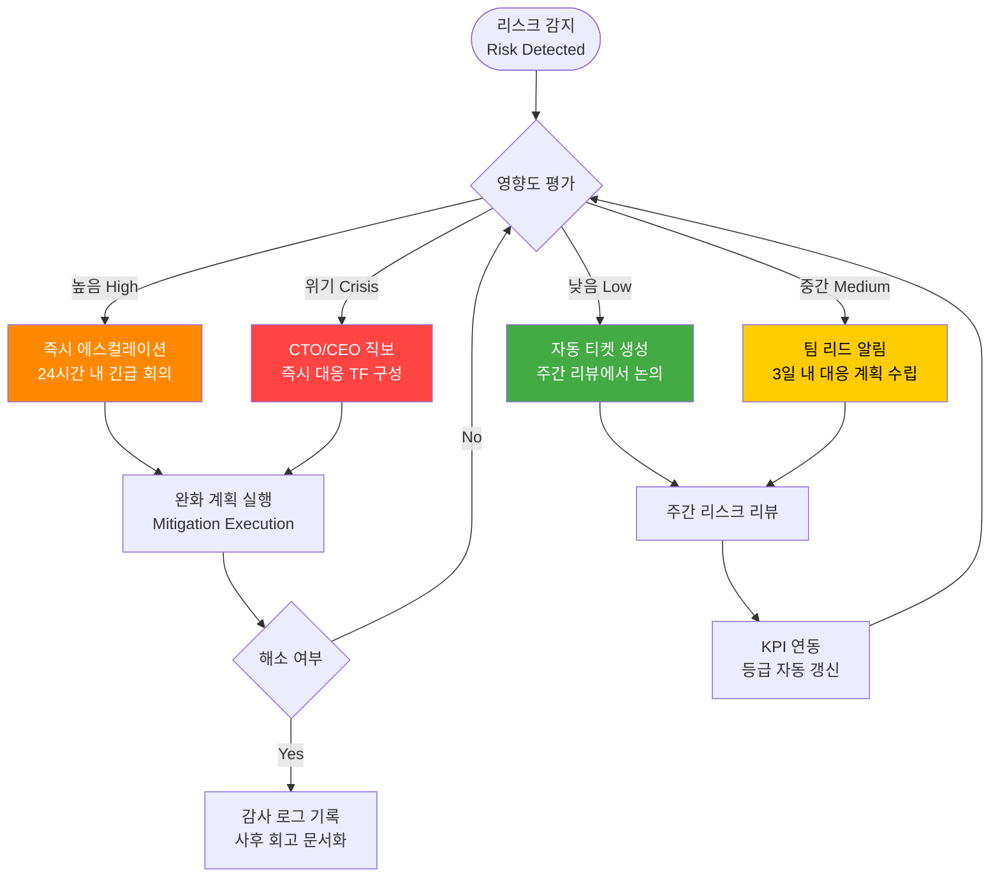

# 07. 리스크 분석 및 대응 전략 (Risk Analysis & Mitigations)

> **TL;DR**
> - AI 콘텐츠 품질 불균일·데이터 Cold Start·LLM 비용 증가가 가장 높은 우선순위 리스크이며, 단계별 가드레일과 캐싱 전략으로 완화한다.
> - 대형 플랫폼의 자체 도구 출시와 SaaS 경쟁 과밀화에 대응하기 위해 12개 SaaS 통합 파이프라인과 멀티채널 통합이라는 차별화 포지션을 유지한다.
> - 전 리스크를 4단계 에스컬레이션 체계와 자동 모니터링 대시보드로 주간 추적하여 조기 감지 및 신속 대응한다.

---

## 1. 리스크 히트맵 (Risk Heatmap)

```mermaid
quadrantChart
    title 리스크 매트릭스 — 발생 확률 × 영향도
    x-axis 낮음 --> 높음
    y-axis 낮음 --> 높음
    quadrant-1 즉시 대응 (Critical)
    quadrant-2 모니터링 강화 (High Watch)
    quadrant-3 수용 가능 (Acceptable)
    quadrant-4 비상 계획 (Contingency)
    AI 품질 불균일: [0.80, 0.85]
    Cold Start 데이터: [0.75, 0.80]
    셀러 이탈: [0.55, 0.78]
    LLM 비용 증가: [0.50, 0.82]
    플랫폼 경쟁 진입: [0.50, 0.80]
    크롤링 차단: [0.78, 0.55]
    SaaS 경쟁 과밀: [0.75, 0.50]
    핵심 인력 이탈: [0.50, 0.75]
    자금 소진: [0.48, 0.80]
    규제 변화: [0.45, 0.50]
    파트너 의존도: [0.50, 0.48]
    시스템 확장성: [0.22, 0.85]
    Trust Escalation 오작동: [0.20, 0.80]
    이커머스 성장 둔화: [0.22, 0.48]
```

> **범례** — 즉시 대응: 확률 높음·영향 높음 / 비상 계획: 확률 낮음·영향 높음

---

## 2. 기술 리스크 (Technical Risks)

| # | 리스크 | 발생 확률 | 영향도 | 위험 등급 | 완화 전략 |
|---|--------|:---------:|:------:|:---------:|-----------|
| T1 | AI 생성 콘텐츠 품질 불균일 | 높음 | 높음 | **Critical** | 품질 스코어링 파이프라인 + 인간 검수 병행; 템플릿 기반 가드레일([→ 04 아키텍처](./04-architecture.md)) |
| T2 | 데이터 품질 Cold Start | 높음 | 높음 | **Critical** | Phase 1 초기 시딩 전략; 점진적 데이터 축적 설계([→ 06 로드맵](./06-roadmap.md)) |
| T3 | LLM API 비용 증가 | 중간 | 높음 | **High** | 모델 경량화(sLLM 전환), 응답 캐싱, 오픈소스 LLM 대안 확보 |
| T4 | 크롤링 차단 / API 변경 | 높음 | 중간 | **High** | 다중 데이터 소스 병렬 운영; 공식 API 우선, 크롤링 폴백 구조 |
| T5 | ML 모델 정확도 저하 | 중간 | 높음 | **High** | A/B 테스트 상시 운영; 점진적 Autopilot 승격; Trust Escalation 제어([→ 04 아키텍처](./04-architecture.md)) |
| T6 | 시스템 확장성 한계 | 낮음 | 높음 | **Contingency** | 마이크로서비스 아키텍처 설계; 수평 스케일링(Kubernetes HPA) 사전 구현 |

---

## 3. 시장 리스크 (Market Risks)

| # | 리스크 | 발생 확률 | 영향도 | 위험 등급 | 완화 전략 |
|---|--------|:---------:|:------:|:---------:|-----------|
| M1 | 대형 플랫폼(쿠팡·네이버) 자체 도구 출시 | 중간 | 높음 | **High** | 멀티채널 통합 차별화; 플랫폼 종속 회피 전략([→ 02 비즈니스 모델](./02-business-model.md)) |
| M2 | 셀러 이탈 / 낮은 전환율 | 중간 | 높음 | **High** | 프리미엄 모델 + PageFactory 10분 체험으로 빠른 가치 증명([→ 03 제품 기능](./03-product-features.md)) |
| M3 | SaaS 경쟁 과밀화 | 높음 | 중간 | **High** | 12개 SaaS 통합 파이프라인이라는 고유 포지션 유지; 네트워크 효과 구축 |
| M4 | 규제 변화 (광고법·개인정보보호법) | 중간 | 중간 | **Medium** | 법률 자문 체계 구축; 컴플라이언스 자동화 모듈 분리 |
| M5 | 이커머스 시장 성장 둔화 | 낮음 | 중간 | **Low** | 동남아 등 글로벌 확장 옵션; B2B 에이전시 피벗 가능성 |

---

## 4. 운영 리스크 (Operational Risks)

| # | 리스크 | 발생 확률 | 영향도 | 위험 등급 | 완화 전략 |
|---|--------|:---------:|:------:|:---------:|-----------|
| O1 | 핵심 인력 이탈 | 중간 | 높음 | **High** | 문서화 강화(이 문서 포함); 지식 공유 체계(내부 위키); 경쟁력 있는 처우 |
| O2 | 자금 소진 (Runway 단축) | 중간 | 높음 | **High** | Phase 1 제품으로 조기 매출 확보; 린 운영 원칙([→ 06 로드맵](./06-roadmap.md)) |
| O3 | 파트너 / 외부 API 의존도 | 중간 | 중간 | **Medium** | 다중 공급처 계약; API 추상화 계층으로 교체 비용 최소화 |
| O4 | Trust Escalation 오작동 | 낮음 | 높음 | **Contingency** | 보수적 승격 기준 설정; 즉시 롤백 메커니즘; 전 자동화 결정 감사 로그 |

---

## 5. 대응 흐름 (Escalation Flow)



---

## 6. 리스크 모니터링 체계

### 6.1 모니터링 레이어

| 레이어 | 도구 | 갱신 주기 | 담당 |
|--------|------|:---------:|------|
| 인프라·서비스 가용성 | Grafana + Prometheus | 실시간 | DevOps |
| LLM 비용·품질 지표 | 내부 대시보드 + Cost API | 일별 | ML Eng |
| 크롤링 성공률 | 자동화 알람 (Slack 연동) | 시간별 | Backend |
| 비즈니스 KPI (전환율·이탈) | Mixpanel / Amplitude | 주별 | Product |
| 규제·시장 동향 | 법률 자문 월간 보고 | 월별 | CEO/법무 |

### 6.2 에스컬레이션 4단계

```
낮음(Low) → 중간(Medium) → 높음(High) → 위기(Crisis)
   ↑                                          ↑
자동 감지                              즉시 TF 구성
```

- **낮음**: 자동 티켓 생성, 주간 리뷰에서 논의
- **중간**: 팀 리드 알림, 3일 내 대응 계획 수립
- **높음**: 즉시 에스컬레이션, 24시간 내 긴급 미팅
- **위기**: CTO·CEO 직보, 즉시 대응 TF 구성 및 외부 공지 검토

### 6.3 주간 리스크 리뷰 아젠다

1. 신규 리스크 식별 (15분)
2. 기존 리스크 등급 업데이트 (KPI 연동 자동 초안) (10분)
3. 진행 중인 완화 작업 현황 (15분)
4. 다음 주 우선 대응 항목 결정 (10분)

---

## 7. 상호 참조 (Cross References)

| 관련 문서 | 연관 리스크 |
|-----------|-------------|
| [01 개요](./01-overview.md) | 비전·목표 맥락에서 전략적 리스크 이해 |
| [02 비즈니스 모델](./02-business-model.md) | M1·M2·M5 시장 리스크 수익 모델 연계 |
| [03 제품 기능](./03-product-features.md) | T1·T5 AI 품질 및 Trust Escalation 기능 구현 |
| [04 아키텍처](./04-architecture.md) | T4·T6 크롤링·확장성 기술 설계 |
| [05 데이터 전략](./05-data-strategy.md) | T2 Cold Start 데이터 수집·시딩 전략 |
| [06 로드맵](./06-roadmap.md) | O2 Runway 관리 및 Phase별 리스크 타임라인 |

---

*최종 업데이트: 2026-03-08 | 다음 리뷰 예정: 2026-03-15 (주간 리스크 리뷰)*
