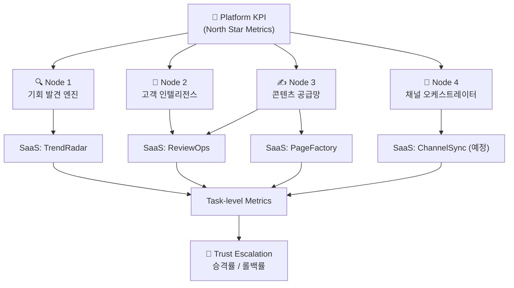

# 08. 성과 지표 체계 (Metrics & KPIs)

> **TL;DR**
> - AutoMarket의 KPI는 Platform → Node → SaaS → Task 4계층 구조로 관리된다.
> - North Star Metric은 TTR(Time-to-Revenue)이며, Phase 1 목표는 72시간, Phase 4는 24시간이다.
> - Trust Escalation 지표(승격률·롤백률)가 자동화 건전성의 핵심 안전 장치다.

---

## 관련 문서

- [01. 프로젝트 개요](./01-project-overview.md)
- [03. 신경계 아키텍처](./03-nervous-system-architecture.md)
- [05. SaaS 제품 로드맵](./05-saas-product-roadmap.md)
- [06. Trust Escalation 모델](./06-trust-escalation-model.md)
- [07. 수익화 전략](./07-monetization-strategy.md)

---

## KPI 계층 구조 (Hierarchy Diagram)



---

## 1. 플랫폼 전체 KPI (North Star Metrics)

| KPI | 정의 | 목표 (Phase 1) | 목표 (Phase 4) |
|-----|------|:--------------:|:--------------:|
| **TTR** (Time-to-Revenue) | 트렌드 감지 → 첫 매출까지 소요 시간 | 72시간 | 24시간 |
| **전체 자동화율** | Autopilot 처리 태스크 비율 | 40% | 75% |
| **MAU** (Monthly Active Users) | 월간 활성 사용자 수 | 1,000명 | 50,000명 |
| **MRR** (Monthly Recurring Revenue) | 월간 반복 매출 | 1,000만 원 | 5억 원 |
| **NPS** (Net Promoter Score) | 순추천지수 | 40+ | 60+ |

> TTR은 신경계 아키텍처의 처리 속도를 집약적으로 반영하는 단일 지표다. 자세한 아키텍처 구조는 [03. 신경계 아키텍처](./03-nervous-system-architecture.md)를 참조한다.

---

## 2. 노드별 KPI (Node-level KPIs)

### Node 1: 기회 발견 엔진 (Opportunity Discovery Engine)

| KPI | 정의 | 목표 |
|-----|------|:----:|
| 기회 발견율 | 기회 스코어 70+ 상품 발굴 건수 | 월 50건+ |
| 기회 정확도 (Accuracy) | 추천 상품 중 실제 판매 성공 비율 | 60%+ |
| 소싱 매칭 시간 | 상품 확정 → 공급처 매칭 완료 소요 시간 | 4시간 이내 |

### Node 2: 고객 인텔리전스 (Customer Intelligence)

| KPI | 정의 | 목표 |
|-----|------|:----:|
| 페르소나 정확도 | 세그먼트별 전환율 예측 정확도 | 80%+ |
| 이탈 예측 정확도 (Churn Prediction) | 실제 이탈 고객 중 사전 포착 비율 | 70%+ |
| LTV 예측 오차 | 예측 LTV vs 실제 LTV 오차 범위 | ±15% 이내 |

### Node 3: 콘텐츠 공급망 (Content Supply Chain)

| KPI | 정의 | 목표 |
|-----|------|:----:|
| 콘텐츠 생성 시간 | 상품 입력 → 상세페이지 완성 소요 시간 | 10분 이내 |
| 콘텐츠 품질 스코어 | AI 생성 결과물 vs 전문가 제작 비교 평점 | 80%+ 수준 |
| 리뷰 확보율 | 체험단 배포 → 리뷰 작성 완료 비율 | 85%+ |
| 인플루언서 ROI | 투입 비용 대비 매출 기여 배수 | 3x+ |

### Node 4: 채널 오케스트레이터 (Channel Orchestrator)

| KPI | 정의 | 목표 |
|-----|------|:----:|
| 채널 라이브 시간 | 콘텐츠 완성 → 채널 등록 완료 소요 시간 | 1시간 이내 |
| ROAS (Return on Ad Spend) | 광고비 대비 매출 수익률 | 300%+ |
| 재고 동기화 정확도 | 채널 간 재고 불일치 발생 비율 | 99%+ |

---

## 3. SaaS 제품별 KPI (Phase 1 기준)

| 제품 | 핵심 KPI | 측정 주기 | Phase 1 목표 |
|------|----------|:---------:|-------------|
| **PageFactory** | 생성 건수, 사용자 만족도, 유료 전환율 | 일간 | 월 5,000건 / 만족도 4.0+ / 전환율 5% |
| **TrendRadar** | 예측 정확도, 기회 스코어 활용률 | 주간 | 정확도 65% / 활용률 40% |
| **ReviewOps** | 리뷰어 DB 규모, 체험단 완료율, 월간 리텐션 | 일간 | DB 5,000명 / 완료율 85% / 리텐션 70% |

> 각 제품의 상세 기능 범위는 [05. SaaS 제품 로드맵](./05-saas-product-roadmap.md)을 참조한다.

---

## 4. Trust Escalation 측정 지표

Trust Escalation은 Copilot(사람 승인 필요) ↔ Autopilot(완전 자동) 전환의 건전성을 추적한다. 상세 모델은 [06. Trust Escalation 모델](./06-trust-escalation-model.md)을 참조한다.

| 지표 | 정의 | 건강 기준 |
|------|------|:---------:|
| **승격률** (Promotion Rate) | 월간 Copilot → Autopilot 전환 태스크 수 | 월 2~5건 (점진적) |
| **롤백률** (Rollback Rate) | 월간 Autopilot → Copilot 강등 태스크 수 | 월 0~1건 (낮을수록 좋음) |
| **AI-Human 일치율** | Copilot 제안과 사람 판단의 일치 비율 | 90%+ |
| **자동화 커버리지** | 전체 태스크 중 Autopilot 처리 비율 | Phase별 점진 증가 |

롤백률이 월 2건을 초과하면 해당 태스크의 Autopilot 자격을 일시 정지하고 원인을 분석한다.

---

## 5. 대시보드 설계 가이드 (Dashboard Design)

### 계층 구조

```
Platform KPI (North Star)
  └── Node KPI (신경계 노드별)
        └── SaaS KPI (제품별)
              └── Task-level Metrics (태스크 단위)
```

### 구현 스택

| 구성 요소 | 도구 | 용도 |
|-----------|------|------|
| 실시간 대시보드 | Grafana | 신경계 상태 모니터링, Node KPI 시각화 |
| 이벤트 스트림 | Kafka / Redis Streams | 태스크 이벤트 수집 |
| 데이터 웨어하우스 | BigQuery / ClickHouse | 일간·주간·월간 집계 |
| 알림 | Slack, Email | 임계값 초과 시 자동 발송 |

### 리포트 주기

| 주기 | 내용 | 수신자 |
|------|------|--------|
| 일간 (Daily) | North Star KPI 자동 요약, 이상 감지 알림 | 운영팀 |
| 주간 (Weekly) | Node KPI 트렌드, SaaS 제품 성과 | 팀 전체 |
| 월간 (Monthly) | Trust Escalation 리포트, MRR 리뷰, 로드맵 진척 | 경영진 |

### 알림 임계값 기준 (Alert Thresholds)

| 지표 | 경고 (Warning) | 위험 (Critical) |
|------|:--------------:|:---------------:|
| TTR 초과 | 목표 +24시간 | 목표 +48시간 |
| ROAS 하락 | 200% 미만 | 150% 미만 |
| 재고 동기화 오류 | 98% 미만 | 95% 미만 |
| 롤백률 증가 | 월 2건 | 월 3건+ |

---

*이 문서는 [07. 수익화 전략](./07-monetization-strategy.md)의 MRR 목표와 연동되며, Phase 진행에 따라 목표치를 갱신한다.*
